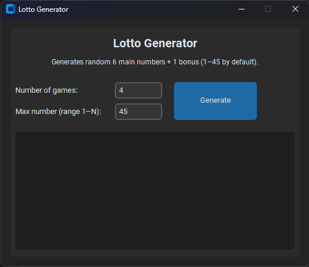

<div align="center">

# 🎲 **Lottery Random**
### _A Modern Python App for Generating 6+1 Lottery Numbers_

</br>


</br>

🚀 *A lightweight, modern Python desktop app for generating 6-number + bonus lottery games.*
</div>


---

**Lottery Random** generates random **6 main lottery numbers + 1 bonus number**, designed for TattsLotto-style games (6/45) but fully configurable to support other ranges such as **1–47** or **1–49**.

It features a clean and modern user interface built with **CustomTkinter** and supports:

- Custom number of games  
- Custom number range (1–N)  
- Adjustable font size  
- Copy-to-clipboard  
- Clear results  
- Modular architecture  

This project is intentionally **simple, modular, and beginner-friendly**, making it a **great assignment or starter project for undergraduate Software Engineering students**.

---

## 🔧 Tech Stack

### **Python**
- Recommended: **Python 3.10+**

### **Libraries**
| Dependency | Purpose |
|-----------|---------|
| **customtkinter** | Modern UI toolkit |
| **random** | Number generation |
| **dataclasses** | Game model |
| **typing** | Type hints |
| **venv** | Virtual environments |

---

## 📁 Project Structure

```
Lottery-Random/
│
├── lotto_generator/
│   ├── __init__.py
│   ├── generator.py     # Lottery number generation logic
│   └── ui.py            # Modern CustomTkinter UI
│
├── app.py               # Launcher
└── requirements.txt     # Dependencies
```

---

## 🚀 Features

- Generate unlimited 6+1 lottery games  
- Change number range (1–45, 1–47, 1–49, etc.)  
- Modern dark UI with CustomTkinter  
- Adjustable font size for results  
- Copy-to-clipboard  
- Clear screen  
- Clean modular architecture  

---

## 🖥️ How to Run

### **1. Clone the repo**

```bash
git clone https://github.com/yourusername/Lottery-Random.git
cd Lottery-Random
```

### **2. Create a virtual environment**

**Windows**
```bash
python -m venv venv
venv\Scripts\activate
```

**Mac/Linux**
```bash
python3 -m venv venv
source venv/bin/activate
```

### **3. Install dependencies**
```bash
pip install -r requirements.txt
```

### **4. Run the app**
```bash
python app.py
```

---

## 🎓 Educational Value

**Lottery Random** is an excellent learning project for undergraduate Software Engineering students because it demonstrates:

### Core Programming Concepts
- Modular Python design  
- Separation of UI and application logic  
- Use of data classes (`dataclasses`)  
- Event-driven programming  
- Type hints and clean code practices  

### Software Engineering Skills
- Working with virtual environments  
- Structuring a real project directory  
- Applying separation of concerns  
- Designing scalable UI and logic layers  

### GUI Development
- Using CustomTkinter to build modern UIs  
- Handling input validation  
- Building responsive event handlers  
- Using fonts, layouts, and widgets effectively  

### Assignment Extension Ideas
These make **excellent university-level tasks**:

- CSV export  
- User preferences  
- Duplicate game prevention  
- Favourite-number list  
- Frequency charts  
- Flask-based web version  
- Kivy/Flet mobile version  
- PyInstaller `.exe` packaging  
- Unit tests for generator logic  

---

## 🛠️ Future Enhancements

Potential features for future versions:

- Export results to `.txt`, `.csv`, `.json`  
- Result history log  
- Theme switcher (light/dark/custom)  
- Powerball-style modes  
- Animated generation effects  
- Statistics dashboard  
- Auto-updater  
- Multi-language support  

---

## 📄 License

MIT License (feel free to modify).

---

## ❤️ Contributing

Contributions are welcome!  
Open issues, submit pull requests, and help expand this project.
